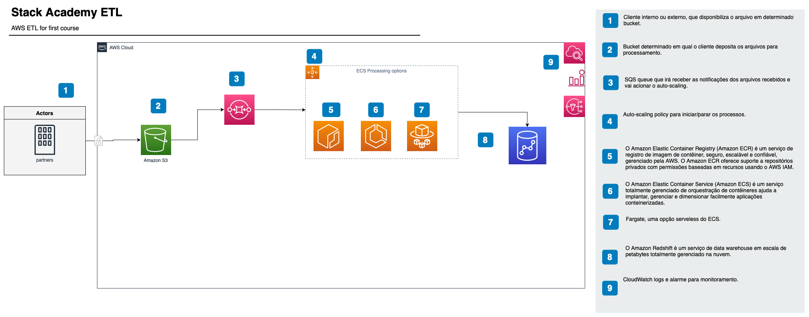

# Dominando Pipelines de Dados na AWS
## Arquitetura 1 - S3 -> SQS -> ECS Fargate -> Redshift

## Índice
1. [Descrição do Projeto](#descrição-do-projeto)
2. [Pré-requisitos](#pré-requisitos)
3. [Começando](#começando)
    1. [Clone o Repositório](#clone-o-repositório)
    2. [Navegue até o Diretório do Projeto](#navegue-até-o-diretório-do-projeto)
    3. [Terraform Init](#terraform-init)
    4. [Terraform Plan](#terraform-plan)
    5. [Terraform Apply](#terraform-apply)
4. [Trabalhando com Docker e ECR](#trabalhando-com-docker-e-ecr)
5. [Configurando a Fila SQS](#configurando-a-fila-sqs)
6. [Conectando ao Redshift e Criando a Tabela](#conectando-ao-redshift-e-criando-a-tabela)
7. [Obtendo Informações da AWS](#obtendo-informações-da-aws)
8. [Regras de Senha Redshift](#regras-de-senha-redshift)
9. [Limpeza](#limpeza)
10. [Mais Informações](#mais-informações)
11. [Aviso](#aviso)

## Descrição do Projeto <a name="descrição-do-projeto"></a>
Este curso proporciona um estudo prático e aprofundado da Engenharia de Dados na AWS.
Com o uso do Terraform, vamos construir um pipelines de dados usando S3, SQS, ECS com Fargate e Redshift.
Em cada passo, você aprenderá e aplicará as melhores práticas de segurança e otimização, se capacitando para desenvolver soluções robustas e eficientes em uma das plataformas de nuvem mais utilizadas no mundo.

Além disso, enfatizaremos as melhores práticas de segurança na AWS e a eficiência na gestão de custos, proporcionando um entendimento integral da Engenharia de Dados na AWS. Com essas habilidades em mãos, você estará bem preparado para enfrentar os desafios do mundo real na engenharia de dados.



Tecnologias abordadas:

- Amazon Web Services (AWS)
	- SQS - Simple Queue Service
	- ECS - Elastic Container Service
	- S3 - Simple Storage Service
	- Redshift
- Terraform
- Git
- Python
- SQL
- Docker


## Pré-requisitos <a name="pré-requisitos"></a>
Todos os requisitos abaixo são explicados durante as aulas.
Caso tenha dúvidas, consulte o material de apoio ou entre em contato com o professor.

- Conta AWS
- Terraform instalado (Versão recomendada: mais recente)
- AWS CLI instalado e configurado
- Docker instalado e em execução
- Git instalado
- Python 3.6 ou superior
- IDE de sua escolha (Pycharm, VS Code, Sublime Text, Atom, etc.)

Durante `terraform plan` e `terraform apply`, devem ser fornecidos `master_password` do Redshift, `subnet_public_a`, `subnet_public_b` e `default_security_group`. A região preferida é `us-east-1`.

## Começando <a name="começando"></a>
Link do repositório:
```bash
https://github.com/ferramentas-stackacademy/Dominando-Pipelines-de-Dados-AWS
```

### Clone o Repositório <a name="clone-o-repositório"></a>
```bash
git clone git@github.com:ferramentas-stackacademy/Dominando-Pipelines-de-Dados-AWS.git
```

Clona o repositório do projeto para sua máquina local.

### Navegue até o Diretório do Projeto <a name="navegue-até-o-diretório-do-projeto"></a>
O projeto da primeira arquitetura está localizado no diretório `architecture-1`, e dentro dele temos os diretórios `terraform` e `src`.

O diretório `terraform` contém os arquivos de configuração do Terraform, e o diretório `src` contém o código Python que será executado no ECS Fargate.

O primeiro passo que vamos fazer é montar a infraestrutura necessária para o projeto. Para isso, vamos usar o Terraform.

Navega até o diretório do projeto no terminal.
```bash
cd architecture-1/terraform
```


### Terraform Init <a name="terraform-init"></a>
Inicializa o diretório de trabalho do Terraform, baixando qualquer módulo necessário para a configuração.

```bash
terraform init
```


### Terraform Plan <a name="terraform-plan"></a>
Cria um plano de execução, mostrando quais ações o Terraform realizará para alcançar o estado desejado.

```bash
terraform plan -var 'master_password=<senha_do_Redshift>' -var 'subnet_public_a=<ID_da_subnet_A>' -var 'subnet_public_b=<ID_da_subnet_B>' -var 'default_security_group=<ID_do_grupo_de_segurança>'
```

### Terraform Apply <a name="terraform-apply"></a>
Aplica as mudanças necessárias para alcançar o estado desejado. Aqui, você precisa fornecer a senha do mestre do Redshift, IDs de sub-rede e o grupo de segurança padrão.

```bash
terraform apply -var 'master_password=<senha_do_Redshift>' -var 'subnet_public_A_ID=<ID_da_subnet_A>' -var 'subnet_public_B_ID=<ID_da_subnet_B>' -var 'default_security_group=<ID_do_grupo_de_segurança>'
```


**Nota:** Substitua `<senha_do_Redshift>`, `<ID_da_subnet_A>`, `<ID_da_subnet_B>` e `<ID_do_grupo_de_segurança>` pelos seus valores reais.

## Trabalhando com Docker e ECR <a name="trabalhando-com-docker-e-ecr"></a>
Siga estas etapas para criar, marcar e enviar a imagem Docker para o ECR:

```bash
aws ecr get-login-password --region us-east-1 | docker login --username AWS --password-stdin <seu_id_de_conta>.dkr.ecr.us-east-1.amazonaws.com
docker build -t ingest-data-repository .
docker tag ingest-data-repository:latest <seu_id_de_conta>.dkr.ecr.us-east-1.amazonaws.com/ingest-data-repository:latest
docker push <seu_id_de_conta>.dkr.ecr.us-east-1.amazonaws.com/ingest-data-repository:latest
```

Essas ações permitem que você crie uma imagem Docker a partir de um Dockerfile, marque a imagem com uma tag e, em seguida, envie (push) a imagem para um repositório no Amazon ECR. 

Substitua `<seu_id_de_conta>` pelos seus valores reais.

## Configurando a Fila SQS <a name="configurando-a-fila-sqs"></a>
Antes de executar o serviço, é importante remover a mensagem de teste criada na fila SQS. Siga as [instruções oficiais da AWS](https://docs.aws.amazon.com/AWSSimpleQueueService/latest/SQSDeveloperGuide/sqs-delete-message.html) para fazer isso.

## Conectando ao Redshift e Criando a Tabela <a name="conectando-ao-redshift-e-criando-a-tabela"></a>
Para conectar ao Redshift, siga as [instruções oficiais da AWS](https://docs.aws.amazon.com/redshift/latest/mgmt/connecting-via-psql.html). Uma vez conectado, você deve criar a tabela usando o arquivo SQL fornecido no projeto.

## Obtendo Informações da AWS <a name="obtendo-informações-da-aws"></a>
Para instruções sobre como obter os IDs da subnet pública A e B e o grupo de segurança padrão do Console AWS, consulte o [guia oficial da AWS](https://docs.aws.amazon.com/AWSEC2/latest/UserGuide/finding-vpc-id-sg-id-subnet-id.html).

## Regras de Senha Redshift <a name="regras-de-senha-redshift"></a>
Siga estas regras ao criar uma senha mestre do Redshift:
- Deve ter entre 8 e 64 caracteres.
- Deve conter pelo menos uma letra maiúscula, uma letra minúscula e um número.
- Pode usar qualquer caractere ASCII imprimível (código ASCII 33 a 126), exceto '/', '"', ou '@'.
- Para mais informações, consulte o [guia oficial da AWS](https://docs.aws.amazon.com/redshift/latest/mgmt/changing-cluster-password.html).

## Limpeza <a name="limpeza"></a>
Para evitar a cobrança desnecessária da AWS, certifique-se de excluir ou reduzir seus recursos da AWS quando terminar.

## Mais Informações <a name="mais-informações"></a>
Para mais informações ou assistência, poste as dúvidas no fórum da Stack Academy.

## Aviso <a name="aviso"></a>
Observe que podem ser aplicadas cobranças da AWS ao uso dos serviços nesta arquitetura. Certifique-se de parar, excluir ou reduzir os serviços quando terminar para evitar custos desnecessários.
