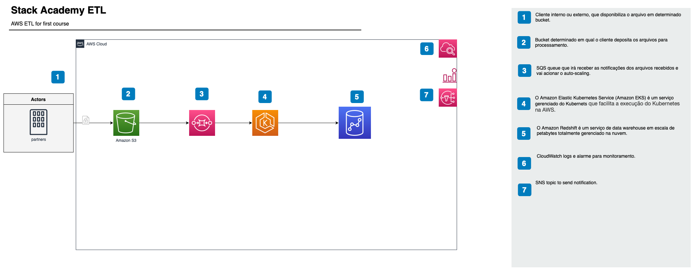

# Dominando Pipelines de Dados na AWS
## Arquitetura 2 - S3 -> SQS -> EKS + Fargate -> Glue -> Athena

## Índice
- [Descrição do Projeto](#descrição-do-projeto)
- [Pré-requisitos](#pré-requisitos)
- [Configuração AWS](#configuração-aws)
- [Estrutura do Repositório](#estrutura-do-repositório)
- [Configuração](#configuração)
- [Uso](#uso)
- [Imagem Docker](#imagem-docker)
- [Sub-rede AWS](#sub-rede-aws)
- [Aplicando a Configuração Kubernetes](#aplicando-a-configuração-kubernetes)
- [Logs do Pod](#logs-do-pod)
- [Limpeza](#limpeza)
- [Mais Informações](#mais-informações)
- [Aviso](#aviso)

## Descrição do Projeto <a name="descrição-do-projeto"></a>
Este curso proporciona um estudo prático e aprofundado da Engenharia de Dados na AWS.
Com o uso do Terraform, vamos construir um pipelines de dados usando S3, SQS, EKS com Fargate, Glue e Athena.
Em cada passo, você aprenderá e aplicará as melhores práticas de segurança e otimização, se capacitando para desenvolver soluções robustas e eficientes em uma das plataformas de nuvem mais utilizadas no mundo.

Além disso, enfatizaremos as melhores práticas de segurança na AWS e a eficiência na gestão de custos, proporcionando um entendimento integral da Engenharia de Dados na AWS. Com essas habilidades em mãos, você estará bem preparado para enfrentar os desafios do mundo real na engenharia de dados.




## Pré-requisitos

Certifique-se de ter instalado na sua máquina local:

Tecnologias abordadas:

- Amazon Web Services (AWS)
	- SQS - Simple Queue Service
	- EKS - Elastic Kubernetes Service
    - Fargate - Serviço de computação serverless para contêineres
	- S3 - Simple Storage Service
	- Athena - Serviço de consultas interativas
    - Glue - Serviço de Data Catalog
- Terraform
- Git
- Python
- SQL
- Docker
- kubectl


A região AWS preferida é `us-east-1`.

## Configuração AWS

Configure seu AWS CLI executando:

```bash
aws configure
```

## Estrutura do Repositório

Aqui está uma visão geral do repositório:

- Arquivos Terraform: Disponiveis dentro do diretório `terraform` e contém arquivos `.tf` para a criação de recursos AWS.
- Código Python: Disponível dentro do diretório `src/ingest-service` e contém o código Python para o serviço EKS.
- Dockerfile: Contém as configurações Docker para construir a imagem Docker, localizado junto com o código Python.
- Configs Kubernetes: Disponivel dentro do diretório `src/kub_configs` Contém `auth.yaml`, `log.yaml`, e `deploy.yaml` para a configuração do Kubernetes.

## Configuração

Primeiro, clone este repositório:

```bash
git clone https://github.com/ferramentas-stackacademy/Dominando-Pipelines-de-Dados-AWS.git
```

Em seguida, navegue até o repositório:

```bash
cd architecture-2/terraform
```

## Uso

### Inicialização do Terraform

Inicialize o Terraform:

```bash
terraform init
```

Este comando inicializa várias configurações e dados locais que serão usados pelos comandos subsequentes.

### Plano do Terraform

Veja o plano de execução:

```bash
terraform plan -var 'vpc_id=<ID_VPC>' -var 'private_subnet_cidr=<BLOCO_CIDR>' -var 'subnet_id=<ID_SUB_REDE_B>'
```
Este comando cria um plano de execução, determinando quais ações são necessárias para alcançar o estado desejado especificado nos arquivos de configuração.

### Aplicar o Terraform

Aplique o plano de execução:

```bash
terraform apply
```

Este comando executa as ações propostas no plano do Terraform.

## Imagem Docker

navegue até o diretório `src/injest-service`:

```bash
cd architecture-2/src/ingest-service
```

Construa a imagem Docker:

```bash
docker build -t stack-academy-eng-dados-2023-ingest-data-repository-eks:latest .
```

Este comando lê o Dockerfile na pasta atual e gera uma imagem Docker.

Marque a imagem Docker:

```bash
docker tag stack-academy-eng-dados-2023-ingest-data-repository-eks:latest <id_da_conta_aws>.dkr.ecr.us-east-1.amazonaws.com/stack-academy-eng-dados-2023-ingest-data-repository-eks:latest
```

Este comando atribui uma tag à imagem Docker para facilitar a sua localização e gestão.

Envie a imagem Docker para o ECR:

```bash
docker push <id_da_conta_aws>.dkr.ecr.us-east-1.amazonaws.com/stack-academy-eng-dados-2023-ingest-data-repository-eks:latest
```

Este comando carrega a imagem Docker para o repositório ECR na AWS.

## Sub-rede AWS

Para encontrar o ID da Sub-rede B, vá para o Console de Gerenciamento AWS, navegue até o serviço VPC, selecione 'Sub-redes', e localize o ID da sub-rede na lista.

## Aplicando a Configuração Kubernetes

Após aplicar o Terraform, atualize a configuração do kubectl:

```bash
aws eks --region us-east-1 update-kubeconfig --name <nome_do_cluster>
```

navegue até o diretório `src/kub_configs`:

```bash
cd architecture-2/src/kub_configs
```

Aplique os arquivos de configuração do Kubernetes:

```bash
kubectl apply -f auth.yaml
kubectl apply -f log.yaml
kubectl apply -f deploy.yaml
```
Lembre-se de remover a mensagem de teste criada na fila SQS antes de executar o serviço.


## Logs do Pod

Para obter os logs de um Pod, execute:

```bash
kubectl logs <nome_do_pod>
```

Agora sua infraestrutura AWS está pronta para uso!


## Limpeza <a name="limpeza"></a>
Para evitar a cobrança desnecessária da AWS, certifique-se de excluir ou reduzir seus recursos da AWS quando terminar.

## Mais Informações <a name="mais-informações"></a>
Para mais informações ou assistência, poste as dúvidas no fórum da Stack Academy.

## Aviso <a name="aviso"></a>
Observe que podem ser aplicadas cobranças da AWS ao uso dos serviços nesta arquitetura. Certifique-se de parar, excluir ou reduzir os serviços quando terminar para evitar custos desnecessários.
