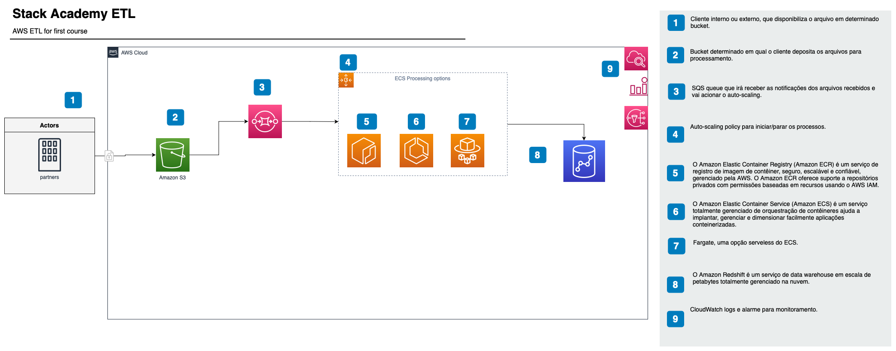
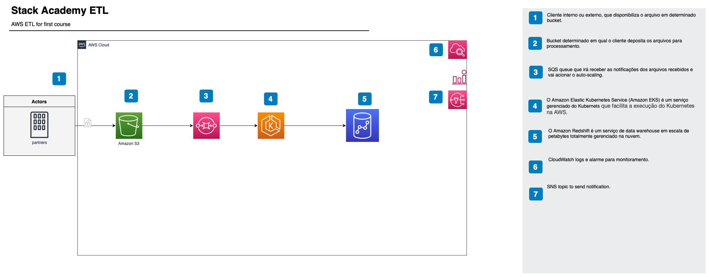

# Stack Academy

### [Dominando Pipelines de Dados na AWS](#dominando-pipelines-de-dados-na-aws)
- [Descrição do Projeto](#descrição-do-projeto)
- [Fonte de Dados](#fonte-de-dados)
- [Pré-requisitos](#pré-requisitos)
- [Configuração AWS](#configuração-aws)
- [Estrutura do Repositório](#estrutura-do-repositório)
- [Limpeza](#limpeza)
- [Mais Informações](#mais-informações)
- [Aviso](#aviso)


## Descrição do Projeto <a name="descrição-do-projeto"></a>
Este curso proporciona um estudo prático e aprofundado da Engenharia de Dados na AWS.
Com o uso do Terraform, vamos construir dois pipelines de dados: Um usando ECS e Redshift, e outro usando EKS e Athena.
Em cada passo, você aprenderá e aplicará as melhores práticas de segurança e otimização, se capacitando para desenvolver soluções robustas e eficientes em uma das plataformas de nuvem mais utilizadas no mundo.

Além disso, enfatizaremos as melhores práticas de segurança na AWS e a eficiência na gestão de custos, proporcionando um entendimento integral da Engenharia de Dados na AWS. Com essas habilidades em mãos, você estará bem preparado para enfrentar os desafios do mundo real na engenharia de dados.


Tecnologias abordadas:

- Amazon Web Services (AWS)
	- SQS - Simple Queue Service
	- ECS - Elastic Container Service
	- EKS - Elastic Kubernetes Service
	- S3 - Simple Storage Service
	- Redshift
	- Athena
- Terraform
- Git
- Python
- SQL
- Docker

A região AWS usada no curso é `us-east-1`.

## Fonte de Dados

A fonte de dados utilizada neste curso é o [Kaggle](https://www.kaggle.com/), uma plataforma de ciência de dados que hospeda competições de Machine Learning e conjuntos de dados públicos.
Foi usado especificamente o conjunto de dados [IMDb Dataset](https://www.kaggle.com/datasets/ashirwadsangwan/imdb-dataset?select=title.basics.tsv), dentre todos os arquivos escolhemos o `title.basics.tsv`, que contém dados de filmes e séries de TV, incluindo títulos, elenco, membros da equipe, classificações e muito mais.


## Pré-requisitos

Certifique-se de ter instalado na sua máquina local:
- [Terraform](https://learn.hashicorp.com/tutorials/terraform/install-cli)
- [Git](https://git-scm.com/book/en/v2/Getting-Started-Installing-Git)
- [Python](https://www.python.org/downloads/) 3.6+
- [Docker](https://docs.docker.com/get-docker/)
- [AWS CLI](https://docs.aws.amazon.com/cli/latest/userguide/install-cliv2.html)
- [kubectl](https://kubernetes.io/docs/tasks/tools/install-kubectl/)
- IDE de sua preferência (VSCode, PyCharm, etc)

## Configuração AWS

Para configurar o acesso à AWS, você pode seguir [este tutorial](https://docs.aws.amazon.com/cli/latest/userguide/cli-configure-quickstart.html).

## Estrutura do Repositório

Este repositório está organizado da seguinte forma:

```
├── README.md
├── architecture-1
│   ├── README.md
│   ├── src
|   |   ├── database -> scripts de criação de tabela
|   |   ├── ingest-service -> scripts de ETL
|   ├── terraform
├── architecture-2
│   ├── README.md
│   ├── src
|   |   ├── kub_configs -> scripts de configuração do kubernetes
|   |   ├── ingest-service -> scripts de ETL
|   ├── terraform
└── ...
```
Na raiz do repositório, você encontrará o arquivo `README.md` com as instruções gerais do curso.
No diretório `docs` você encontrará os [slides do curso](docs/Stack.pptx.pdf).


No diretório `architecture-1` você encontrará o código do pipeline ECS + Redshift.


No diretório `architecture-2` você encontrará o código do pipeline EKS + Athena.


Em cada diretório, você encontrará um arquivo `README.md` com as instruções específicas de cada pipeline.

## Limpeza

Para evitar cobranças desnecessárias, lembre-se de destruir os recursos criados ao final de cada módulo.

## Mais Informações

Para mais informações sobre o curso, acesse [este link](https://stackacademy.com.br/curso/dominando-pipelines-de-dados-na-aws).

## Aviso

Observe que podem ser aplicadas cobranças da AWS ao uso dos serviços nesta arquitetura. Certifique-se de parar, excluir ou reduzir os serviços quando terminar para evitar custos desnecessários.
Este repositório contém código de exemplo e não deve ser usado em produção.